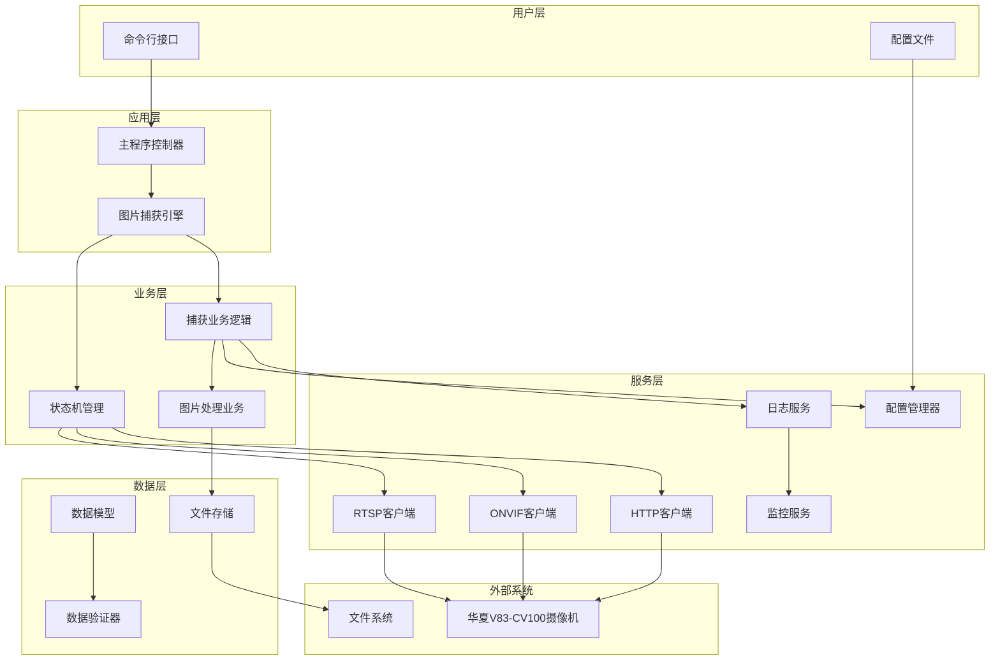
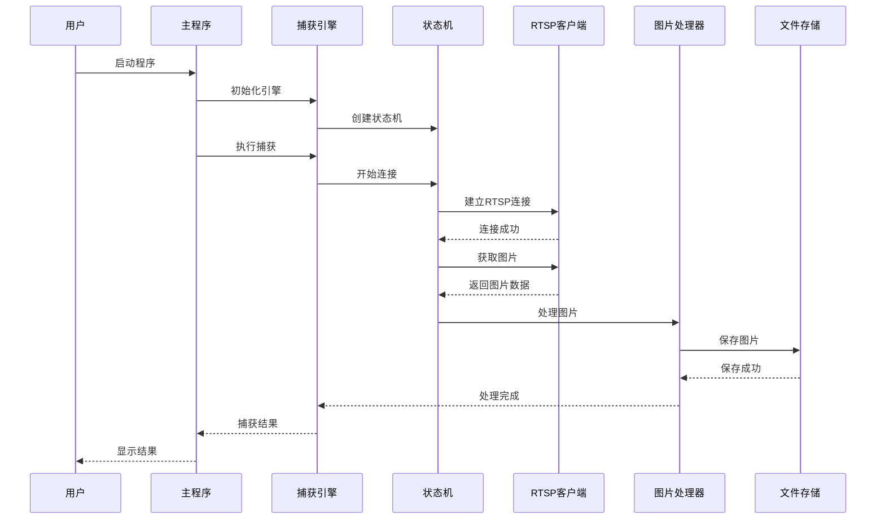
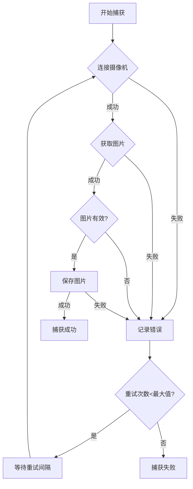
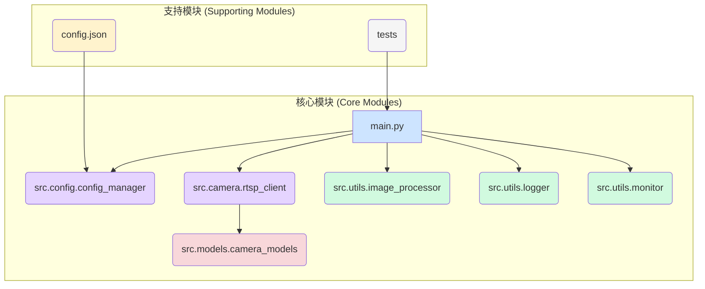

# 华夏V83-CV100摄像机图片捕获工具 - 技术架构设计

## 📐 架构概览

### 系统架构图



### 分层架构说明

#### 1. 用户层 (Presentation Layer)
- **命令行接口**: 提供用户交互入口
- **配置文件**: 外部化配置管理

#### 2. 应用层 (Application Layer)
- **主程序控制器**: 程序入口和流程编排
- **图片捕获引擎**: 核心业务流程控制

#### 3. 业务层 (Business Layer)
- **状态机管理**: 连接和捕获状态控制
- **捕获业务逻辑**: 图片获取业务规则
- **图片处理业务**: 图片处理和保存逻辑

#### 4. 服务层 (Service Layer)
- **协议客户端**: RTSP/ONVIF/HTTP协议实现
- **配置管理器**: 配置加载和验证
- **日志服务**: 统一日志记录
- **监控服务**: 性能和健康监控

#### 5. 数据层 (Data Layer)
- **数据模型**: 核心数据结构定义
- **数据验证器**: 数据完整性验证
- **文件存储**: 图片文件存储管理

## 🏗️ 模块设计

### 目录结构

```
capture_ipc/
├── main.py                 # 程序入口
├── config.json            # 配置文件
├── requirements.txt       # 依赖管理
├── README.md              # 项目说明
├── .gitignore             # Git忽略文件
├── src/                   # 源代码目录
│   ├── __init__.py
│   ├── config/            # 配置管理模块
│   │   ├── __init__.py
│   │   ├── config_manager.py
│   │   └── validators.py
│   ├── camera/            # 摄像机客户端模块
│   │   ├── __init__.py
│   │   ├── rtsp_client.py
│   │   ├── onvif_client.py
│   │   └── http_client.py
│   ├── core/              # 核心业务模块
│   │   ├── __init__.py
│   │   ├── state_machine.py
│   │   ├── capture_engine.py
│   │   └── capture_service.py
│   ├── utils/             # 工具模块
│   │   ├── __init__.py
│   │   ├── image_processor.py
│   │   ├── logger.py
│   │   └── monitor.py
│   └── models/            # 数据模型
│       ├── __init__.py
│       └── camera_models.py
├── tests/                 # 测试目录
│   ├── __init__.py
│   ├── test_config.py
│   ├── test_rtsp_client.py
│   ├── test_image_processor.py
│   └── test_integration.py
├── docs/                  # 文档目录
│   ├── data_flow.md
│   └── api_reference.md
└── logs/                  # 日志目录
    └── capture.log
```

### 核心模块详细设计

#### 1. 配置管理模块 (config)

```python
# config_manager.py
class ConfigManager:
    """配置管理器"""
    
    def load_config(self, config_path: str) -> dict:
        """加载配置文件"""
        pass
    
    def save_config(self, config: dict, config_path: str) -> bool:
        """保存配置文件"""
        pass
    
    def validate_config(self, config: dict) -> bool:
        """验证配置有效性"""
        pass
    
    def get_camera_config(self) -> CameraConfig:
        """获取摄像机配置"""
        pass

# validators.py
class ConfigValidator:
    """配置验证器"""
    
    @staticmethod
    def validate_ip(ip: str) -> bool:
        """验证IP地址格式"""
        pass
    
    @staticmethod
    def validate_port(port: int) -> bool:
        """验证端口范围"""
        pass
    
    @staticmethod
    def validate_credentials(username: str, password: str) -> bool:
        """验证认证信息"""
        pass
```

#### 2. 摄像机客户端模块 (camera)

```python
# rtsp_client.py
class RTSPClient:
    """RTSP协议客户端"""
    
    def __init__(self, config: CameraConfig):
        self.config = config
        self.cap = None
        self.state = ConnectionState.DISCONNECTED
    
    def connect(self) -> bool:
        """建立RTSP连接"""
        pass
    
    def capture_frame(self) -> Tuple[bool, np.ndarray]:
        """获取单帧图片"""
        pass
    
    def disconnect(self) -> bool:
        """断开连接"""
        pass
    
    def is_connected(self) -> bool:
        """检查连接状态"""
        pass

# onvif_client.py
class ONVIFClient:
    """ONVIF协议客户端"""
    
    def __init__(self, config: CameraConfig):
        self.config = config
        self.camera = None
    
    def connect(self) -> bool:
        """建立ONVIF连接"""
        pass
    
    def get_snapshot(self) -> bytes:
        """获取快照"""
        pass
    
    def get_device_info(self) -> dict:
        """获取设备信息"""
        pass
```

#### 3. 核心业务模块 (core)

```python
# state_machine.py
class CaptureStateMachine:
    """图片捕获状态机"""
    
    def __init__(self):
        self.current_state = CaptureState.DISCONNECTED
        self.transitions = self._build_transitions()
    
    def transition_to(self, new_state: CaptureState) -> bool:
        """状态转换"""
        pass
    
    def handle_event(self, event: CaptureEvent) -> CaptureState:
        """处理事件"""
        pass
    
    def is_terminal_state(self) -> bool:
        """检查是否为终止状态"""
        pass

# capture_engine.py
class CaptureEngine:
    """图片捕获引擎"""
    
    def __init__(self, config_manager: ConfigManager):
        self.config_manager = config_manager
        self.state_machine = CaptureStateMachine()
        self.clients = self._init_clients()
    
    def capture_image(self) -> CaptureResult:
        """执行图片捕获"""
        pass
    
    def _select_client(self) -> BaseClient:
        """选择合适的客户端"""
        pass
    
    def _handle_capture_error(self, error: Exception) -> None:
        """处理捕获错误"""
        pass
```

#### 4. 工具模块 (utils)

```python
# image_processor.py
class ImageProcessor:
    """图片处理器"""
    
    def save_image(self, image_data: np.ndarray, file_path: str) -> bool:
        """保存图片"""
        pass
    
    def validate_image(self, image_data: np.ndarray) -> bool:
        """验证图片有效性"""
        pass
    
    def convert_format(self, image_data: np.ndarray, format: str) -> bytes:
        """转换图片格式"""
        pass
    
    def add_metadata(self, image_path: str, metadata: dict) -> bool:
        """添加图片元数据"""
        pass

# logger.py
class Logger:
    """日志管理器"""
    
    def __init__(self, config: dict):
        self.config = config
        self.logger = self._setup_logger()
    
    def info(self, message: str, **kwargs) -> None:
        """记录信息日志"""
        pass
    
    def warning(self, message: str, **kwargs) -> None:
        """记录警告日志"""
        pass
    
    def error(self, message: str, **kwargs) -> None:
        """记录错误日志"""
        pass
```

#### 5. 数据模型 (models)

```python
# camera_models.py
@dataclass
class CameraConfig:
    """摄像机配置"""
    ip: str
    port: int
    username: str
    password: str
    protocol: str = "rtsp"
    timeout: int = 10
    retry_count: int = 3

@dataclass
class ConnectionStatus:
    """连接状态"""
    is_connected: bool = False
    last_error: Optional[str] = None
    retry_count: int = 0
    last_attempt: Optional[datetime] = None

@dataclass
class ImageInfo:
    """图片信息"""
    timestamp: datetime
    file_path: str
    size: int
    format: str
    metadata: dict = field(default_factory=dict)

@dataclass
class CaptureResult:
    """捕获结果"""
    success: bool
    image_info: Optional[ImageInfo] = None
    error_message: Optional[str] = None
    execution_time: float = 0.0
```

## 🔧 技术选型

### 核心技术栈

| 技术组件 | 选型 | 版本要求 | 选择理由 |
|---------|------|----------|----------|
| **编程语言** | Python | 3.8+ | 丰富的图像处理库，开发效率高 |
| **视频处理** | OpenCV | 4.5.0+ | 成熟的RTSP支持，性能优秀 |
| **ONVIF协议** | onvif-zeep | 0.2.12+ | 标准ONVIF实现，兼容性好 |
| **HTTP请求** | requests | 2.25.0+ | 简单易用，功能完整 |
| **图片处理** | Pillow | 8.0.0+ | 强大的图片处理能力 |
| **测试框架** | pytest | 6.0.0+ | 功能丰富，插件生态完善 |
| **日志管理** | logging | 内置 | Python标准库，无额外依赖 |
| **配置管理** | json | 内置 | 简单易读，无额外依赖 |

### 依赖包详细说明

```txt
# 核心依赖
opencv-python>=4.5.0          # RTSP视频流处理
onvif-zeep>=0.2.12            # ONVIF协议支持
requests>=2.25.0              # HTTP请求处理
Pillow>=8.0.0                 # 图片处理和格式转换

# 开发和测试依赖
pytest>=6.0.0                # 单元测试框架
pytest-mock>=3.0.0           # Mock对象支持
pytest-cov>=2.10.0           # 测试覆盖率
black>=21.0.0                # 代码格式化
flake8>=3.8.0                # 代码风格检查
mypy>=0.812                  # 类型检查

# 可选依赖
psutil>=5.8.0                # 系统监控
schedule>=1.1.0              # 定时任务
cryptography>=3.4.0         # 配置加密
```

## 🔄 数据流设计

### 主要数据流程



### 异常处理流程



## 🔐 安全设计

### 1. 认证安全
- **密码加密存储**: 配置文件中的密码使用AES加密
- **环境变量支持**: 支持通过环境变量传递敏感信息
- **连接超时**: 防止长时间连接占用资源

### 2. 网络安全
- **RTSP over TLS**: 支持加密的RTSP连接
- **输入验证**: 严格验证所有外部输入
- **错误信息脱敏**: 日志中不记录敏感信息

### 3. 文件安全
- **路径验证**: 防止路径遍历攻击
- **权限控制**: 最小权限原则
- **临时文件清理**: 及时清理临时文件

## 📊 性能设计

### 1. 性能目标
- **连接建立时间**: < 5秒
- **单次图片获取**: < 10秒
- **内存使用**: < 100MB
- **并发支持**: 支持多摄像机并发

### 2. 性能优化策略
- **连接池**: 复用RTSP连接
- **异步处理**: 使用异步I/O提升性能
- **缓存机制**: 缓存配置和连接状态
- **资源管理**: 及时释放不用的资源

### 3. 监控指标
- **响应时间**: 各操作的执行时间
- **成功率**: 连接和捕获成功率
- **资源使用**: CPU、内存、网络使用情况
- **错误统计**: 各类错误的发生频率

## 🧪 测试策略

### 1. 单元测试
- **覆盖率要求**: ≥ 85%
- **Mock策略**: 使用Mock对象模拟外部依赖
- **测试数据**: 准备完整的测试数据集

### 2. 集成测试
- **端到端测试**: 完整流程测试
- **协议兼容性**: 测试不同协议的兼容性
- **异常场景**: 测试各种异常情况

### 3. 性能测试
- **压力测试**: 测试系统负载能力
- **稳定性测试**: 长时间运行测试
- **资源泄漏**: 检查内存和连接泄漏

## 📈 扩展性设计

### 1. 协议扩展
- **插件架构**: 支持新协议的插件化扩展
- **接口标准化**: 统一的客户端接口
- **配置驱动**: 通过配置支持新协议

### 2. 功能扩展
- **多摄像机支持**: 支持同时管理多个摄像机
- **定时任务**: 支持定时自动捕获
- **图片处理**: 支持更多图片处理功能

### 3. 部署扩展
- **容器化**: 支持Docker部署
- **微服务**: 支持拆分为微服务架构
- **云原生**: 支持云环境部署

---

**文档版本**: v1.0  
**创建日期**: 2025-01-27  
**最后更新**: 2025-01-27  
**架构师**: AI Assistant  
**状态**: 设计完成，待实施 

