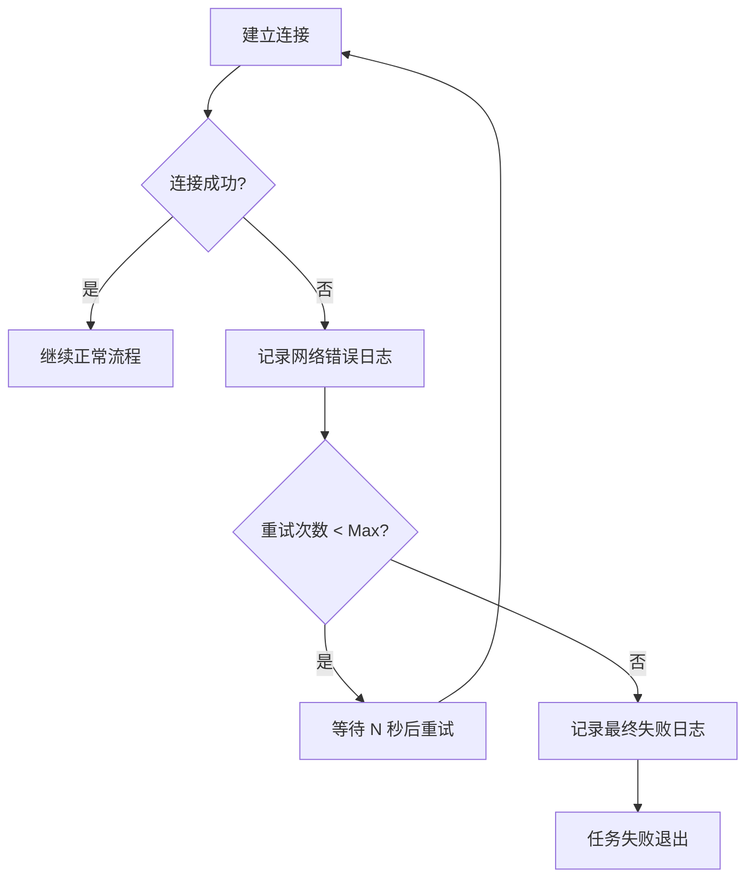
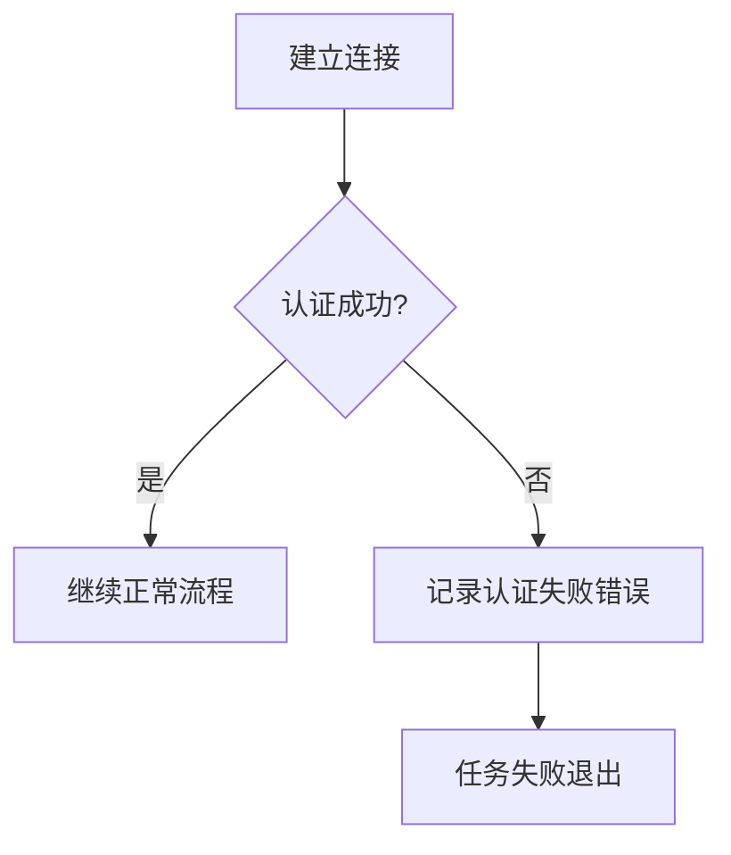
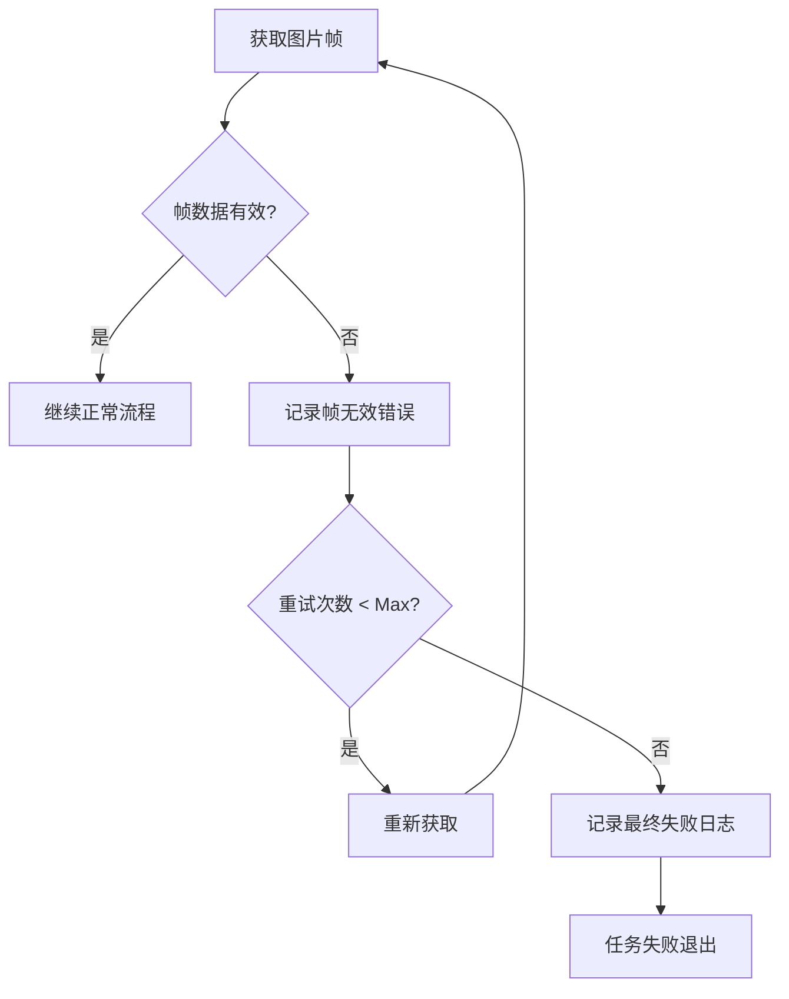

# DES-01: 数据流设计文档

## 1. 概述

本文档定义了从华夏V83-CV100摄像机获取单帧图片的完整数据流，包括正常流程和异常处理流程。

## 2. 正常数据流程

核心流程旨在高效、可靠地完成图片获取任务。

```mermaid
sequenceDiagram
    participant App as 应用主程序
    participant ConfigMgr as 配置管理器
    participant CaptureEngine as 捕获引擎
    participant RTSPClient as RTSP客户端
    participant ImageProc as 图片处理器
    participant Logger as 日志服务

    App->>ConfigMgr: 加载配置
    ConfigMgr-->>App: 返回配置对象
    App->>CaptureEngine: 执行捕ॅ获(config)
    
    CaptureEngine->>Logger: 记录"开始捕获"
    CaptureEngine->>RTSPClient: 建立连接(URL)
    RTSPClient-->>CaptureEngine: 连接成功
    CaptureEngine->>Logger: 记录"连接成功"
    
    CaptureEngine->>RTSPClient: 读取一帧
    RTSPClient-->>CaptureEngine: 返回图片帧数据
    
    CaptureEngine->>ImageProc: 验证图片
    ImageProc-->>CaptureEngine: 图片有效
    
    CaptureEngine->>ImageProc: 保存图片(帧数据, 路径)
    ImageProc-->>CaptureEngine: 保存成功
    CaptureEngine->>Logger: 记录"图片保存成功"
    
    finally 资源释放
        CaptureEngine->>RTSPClient: 断开连接
        RTSPClient-->>CaptureEngine: 连接已释放
        CaptureEngine->>Logger: 记录"任务完成"
    end
```

### 流程步骤详解:
1.  **配置加载**: 程序启动时，`配置管理器`从`config.json`加载并验证配置。
2.  **引擎初始化**: `应用主程序`使用配置初始化`捕获引擎`。
3.  **连接建立**: `捕获引擎`根据配置（优先RTSP）指示`RTSP客户端`建立连接。
4.  **身份认证**: 连接URL中已包含认证信息 (`rtsp://user:pass@ip/...`)。
5.  **图片数据获取**: `RTSP客户端`从视频流中读取一个关键帧。
6.  **图片解码/验证**: `图片处理器`验证获取到的帧是否为有效的图片数据。
7.  **图片保存**: `图片处理器`将有效的图片帧按指定格式（JPEG）和命名规则保存到配置的路径。
8.  **连接释放**: 无论成功与否，在任务结束时都必须释放`RTSPClient`的连接资源。

## 3. 异常处理流程

健壮的异常处理是保证工具稳定性的关键。

### 场景1: 网络连接/超时异常



### 场景2: 认证失败

认证失败是严重错误，通常由配置错误引起，不应重试。



### 场景3: 图片数据无效

如果从流中获取的帧无效或损坏，应尝试重新获取。



## 4. 资源管理

- **连接资源**: RTSP连接是独占资源，必须在每次任务执行完毕后（无论成功或失败）通过`finally`块确保其被正确释放，防止资源泄漏。
- **内存管理**: 图片帧数据会占用较大内存，处理完毕后应及时释放引用，以便垃圾回收。

## 5. 性能优化考虑

- **连接效率**: 避免不必要的重复连接。如果需要连续获取多张图片，应考虑复用连接。
- **超时控制**: 为所有网络操作（连接、读取）设置合理的超时时间，防止因网络问题导致程序永久阻塞。
- **解码效率**: RTSP视频流解码是CPU密集型操作。本工具仅获取单帧，对性能影响有限，但应避免不必要的解码。 